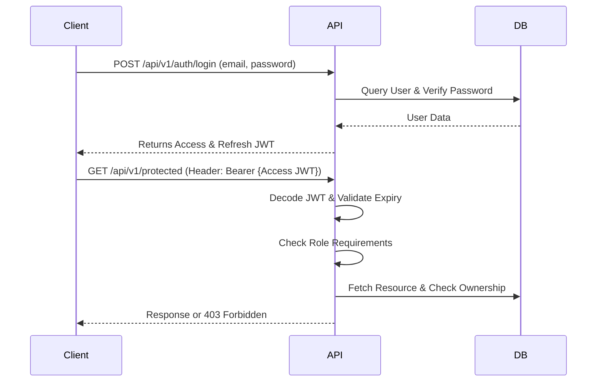

# Authentication & Role-Based Access Control

## 1. Overview
CAMPUSLINK uses **JWT (JSON Web Tokens)** for stateless, scalable authentication, and **Role-Based Access Control (RBAC)** to secure endpoints.

## 2. Roles
The system enforces authorization using the following core roles:
- `SUPER_ADMIN`: Full access to the platform.
- `PLACEMENT_OFFICER`: Manages students, recruiters, and placement workflows.
- `RECRUITER`: Manages company profiles, jobs, and candidate evaluation.
- `STUDENT`: Manages personal profile, views eligible jobs, and tracks applications.
- `MENTOR`: Mentors students, views readiness, and skill gaps.

## 3. Architecture

### Token Strategy
- **Access Tokens**: Short-lived (e.g., 30 minutes). Contains `sub` (User ID), `role`, and `exp`.
- **Refresh Tokens**: Long-lived (e.g., 7 days). Used solely to request a new access token without re-authenticating.

### Flow Diagram


## 4. Endpoints
- `POST /api/v1/auth/register`: Create a new user account (restricted to Student role in MVP).
- `POST /api/v1/auth/login`: Authenticate and receive `access_token` and `refresh_token`.
- `POST /api/v1/auth/refresh`: Submit a refresh token to get a new access/refresh pair.
- `GET /api/v1/auth/me`: Get the currently logged-in user profile.

## 5. Security Measures
1. **Password Hashing**: Passwords are mathematically hashed with bcrypt. Raw passwords are never logged or stored.
2. **Environment Secrets**: JWT keys and lifespans are injected via environment variables (`AUTH_JWT_SECRET`).
3. **Pydantic Validation**: All authentication inputs are strictly validated.
4. **Error Handling**: API endpoints throw generic `401 Unauthorized` without leaking internal states. 

## 6. Route Protection & Ownership
Using FastAPI dependencies, protecting a route is as simple as:
```python
@app.get("/student/data")
def get_data(current_user: User = Depends(require_role(UserRole.STUDENT))):
    return {"message": "Success"}
```

**Resource Ownership Example**: 
If a Recruiter requests `/api/v1/jobs/{job_id}`, the backend first authenticates the recruiter, then verifies that `job.recruiter_id == current_user.recruiter_profile.id`.
