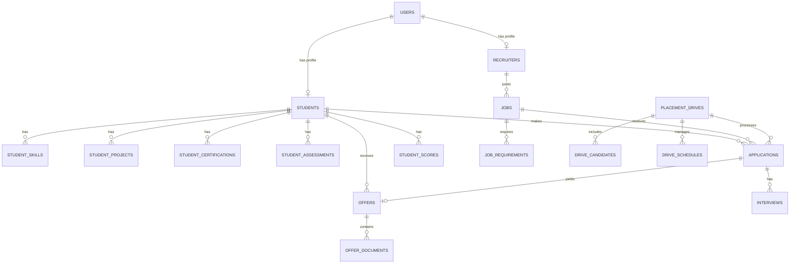

# Database Design

## 1. Overview
The database uses PostgreSQL. It is designed to handle the entire lifecycle of student profiling, matching, scheduling, and offer tracking.

## 2. Entity Relationship Diagram (ERD)

## 3. Core Entities
*(See codebase `backend/src/models/all_models.py` for exact fields)*

- **Identity**: `User`, `Student`, `Recruiter`
- **Skills**: `Skill`, `StudentSkill`, `StudentProject`, `StudentCertification`, `StudentAssessment`
- **Recruiter/Job**: `Job`, `JobRequirement`
- **Placement Drives**: `PlacementDrive`, `DriveCandidate`, `DriveSchedule`
- **Applications**: `Application`, `Interview`, `Offer`, `OfferDocument`
- **Notifications**: `Notification`
- **AI/Scoring**: `StudentScore`, `MatchingScore`, `SkillGap`
- **Auditing**: `AuditLog`

## 4. Key Constraints & Indexes
- **Unique Constraints**: 
  - `User.email` (Unique)
  - `StudentSkill` (Student + Skill) to prevent duplicate skill entries.
  - `JobRequirement` (Job + Skill).
  - `DriveCandidate` (Drive + Student).
  - `Application` (Student + Job).
  - `MatchingScore` (Student + Job + Drive).
- **Foreign Keys**: `ON DELETE CASCADE` is widely used for child entities (e.g. deleting a `Student` cascades to `StudentSkill`), whereas critical references (e.g. `Offer.application_id`) use `ON DELETE SET NULL` to preserve historical integrity.
- **Indexes**: 
  - Frequently queried lookup fields (`email`, `student_identifier`, `branch`, `graduation_year`).
  - Search fields (`job title`, `company_name`, `skill name`).
  - Status fields (`job status`, `application status`, `offer status`).
  - Date fields (`placement drive date`).

## 5. Enums & Statuses
- **UserRole**: SUPER_ADMIN, PLACEMENT_OFFICER, RECRUITER, STUDENT, MENTOR
- **ApplicationStatus**: APPLIED, ELIGIBLE, SHORTLISTED, INTERVIEW, SELECTED, REJECTED, WITHDRAWN
- **OfferStatus**: PENDING, ACCEPTED, DECLINED, DEFERRED, WITHDRAWN, JOINED
- **ReadinessLevel**: NOT_READY, DEVELOPING, READY, HIGHLY_EMPLOYABLE
- **ProficiencyLevel**: BEGINNER, INTERMEDIATE, ADVANCED, EXPERT
- **GapSeverity**: NONE, LOW, MEDIUM, HIGH, CRITICAL
- **SkillSource**: STUDENT, RESUME, ASSESSMENT, CERTIFICATION, VERIFIED, AI_EXTRACTED
- **JobStatus**: DRAFT, PUBLISHED, CLOSED, CANCELLED
- **DriveStatus**: DRAFT, PUBLISHED, REGISTRATION_OPEN, REGISTRATION_CLOSED, IN_PROGRESS, COMPLETED, CANCELLED

## 6. Migration & Seed Strategy
- **Migrations**: Managed by Alembic.
  - Initial schema: `84f38cb5e94c_init_schema_phase_5.py`
  - Phase 6 extension: `2120f53438c8_add_is_mandatory_and_analysis_version_.py` adds `is_mandatory` and `analysis_version` to `skill_gaps`.
- **Seeding**: The `backend/scripts/seed.py` script populates realistic archetypes (Strong, Developing, Incomplete profiles), multi-company jobs, requirement weights, and standardized assessments. Supports `--force` flag.

## 7. Future AI & Vector-Data Strategy
- **pgvector**: Not yet implemented in the schema. When added, vector columns will be stored either as extensions to existing tables or in dedicated embedding tables.
- **Entities receiving embeddings**: `Student` (composite profile vector), `Job` (requirements vector), and `Skill` (semantic meaning).
- **Versioning**: Vector generation models evolve; embeddings will store the `model_version` used. If the source data changes (e.g., student updates resume), an async task will trigger recalculation of vectors and update the embedding rows.
